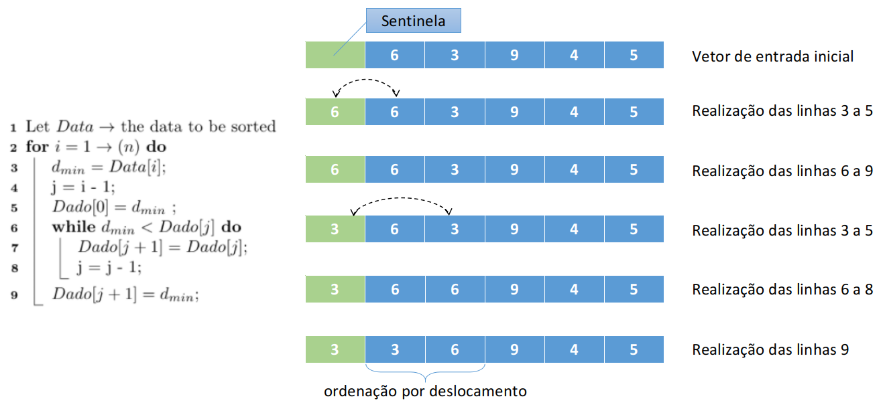

# Insertion Sort: Implementação em C

 
 
 
 

 

 

Insertion sort ou ordenação por inserção é um algoritmo de ordenação que dado uma entrada de tamanho N <b><e1, e2, . . ., en></b>, o resultado é elaborado, inserindo-se elemento a elemento na ordem natural crescente ou decrescente desejada. Para facilitar a compreensão, imagine um grupo de cartas de baralho viradas para baixo. Na primeira interação, você recebe em mãos a primeira carta e a coloca no início de sua sequência. Na segunda interação, você percorre sua mão, encontrando o local ideal para inserir a próxima carta. Assim o faz até que não haja mais cartas a serem inseridas. No final, há uma ordem natural lógica desejada, e assim tem-se o conjunto estruturado corretamente. 

Para a implementação dessa estratégia é preciso criar no vetor de entrada uma posição adicional, reservando-a para as permutações. É comum a utilização da posição de índice 0, a qual é chamada de posição sentinela. Sob essa condição, o laço que realiza as comparações inicia na posição 1 e finaliza na posição N. Vejamos um pequeno exemplo para duas interações do algoritmos com um vetor de 5 posições.

	 

Nessa estratégia de ordenação, o número mínimo de movimentos ocorre quando os registros estão armazenados de forma crescente. Por outro lado, o máximo de comparações (i.e., pior caso) é gerado quando os registros do conjunto se encontram em ordem decrescente. Logo, este método torna-se uma boa solução quando os arquivos apresentarem ordenação parcial no conjunto. Além disso, é uma ótima opção para inserção de novos elementos em conjuntos de elementos já ordenados, apresentando para este caso custo linear ao tamanho da entrada. Por fim, trata-se de uma estratégia estável.

# Compilação e Execução

A lista dinâmica disponibilizada possui um arquivo Makefile que realiza todo o procedimento de compilação e execução. Para tanto, temos as seguintes diretrizes de execução:

| Comando                |  Função                                                                                           |                     
| -----------------------| ------------------------------------------------------------------------------------------------- |
|  `make clean`          | Apaga a última compilação realizada contida na pasta build                                        |
|  `make`                | Executa a compilação do programa utilizando o gcc, e o resultado vai para a pasta build           |
|  `make run`            | Executa o programa da pasta build após a realização da compilação                                 |

# Contatos

 

<a style="color:black" href="mailto:michel@cefetmg.br?subject=[GitHub]%20Source%20Dynamic%20Lists">
✉️ <i>michel@cefetmg.br</i>
</a>
